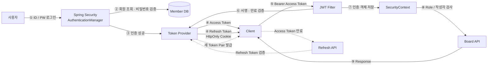
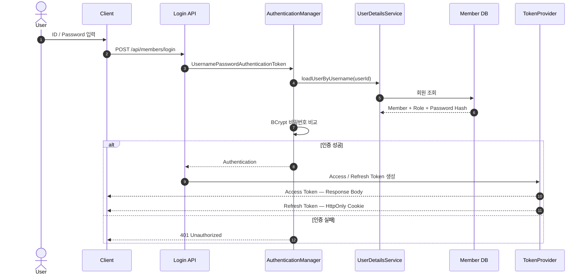
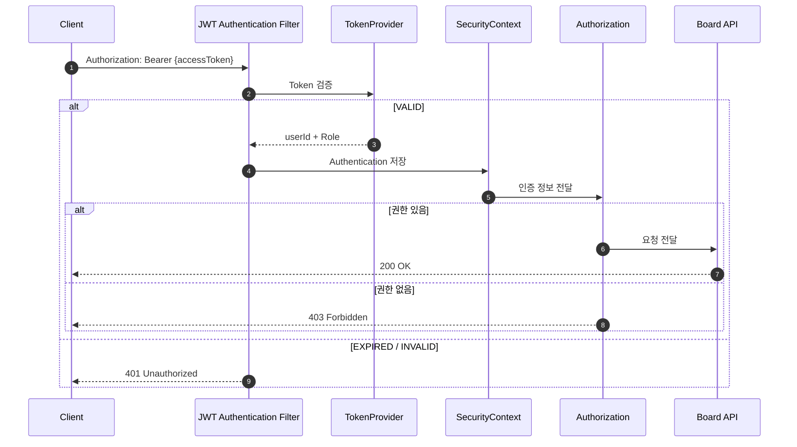
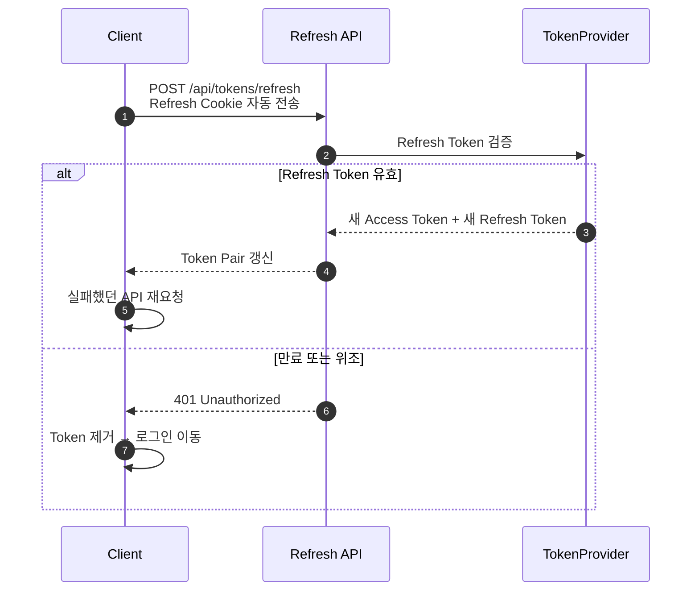
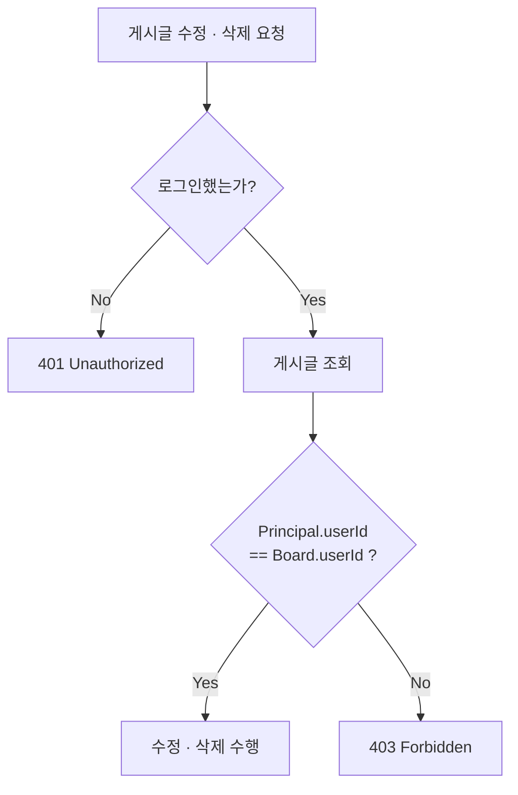
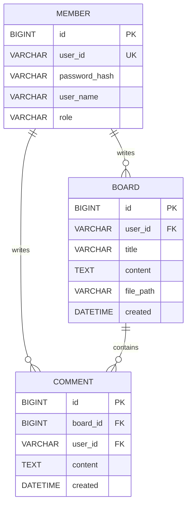

# Basic Board

> 기존 세션 인증을 **Spring Security + JWT**로 전환한 게시판

## JWT Flow 한눈에 보기



```text
로그인 → 토큰 발급 → Bearer Token 전송 → JWT 검증
      → SecurityContext 생성 → 권한 검사 → API 실행
      → Access Token 만료 시 Refresh Token으로 재발급
```

## 1. 로그인과 Token 발급



| Token | 저장 위치 | 용도 | 유효기간 |
|---|---|---|---|
| **Access Token** | Client | API 요청 인증 | 짧게 |
| **Refresh Token** | `HttpOnly` Cookie | Access Token 재발급 | 길게 |

## 2. 인증된 API 요청



## 3. Access Token 재발급



## 4. 인가 — 누가 무엇을 할 수 있는가



> 작성자 `userId`는 Request Body에서 받지 않는다.  
> 검증된 JWT의 `Principal`에서 꺼내 저장하고 비교한다.

| API | 비회원 | 로그인 사용자 | 작성자 본인 |
|---|:---:|:---:|:---:|
| 게시글 목록·상세·검색 | ✅ | ✅ | ✅ |
| 게시글 작성 | ❌ | ✅ | ✅ |
| 댓글 작성 | ❌ | ✅ | ✅ |
| 게시글 수정·삭제 | ❌ | ❌ | ✅ |

| 결과 | HTTP Status |
|---|:---:|
| Token 누락·만료·위조 | `401 Unauthorized` |
| 로그인했지만 작성자가 아님 | `403 Forbidden` |

## 5. ERD



## 적용 기술

`Spring Boot` · `Spring Security` · `JWT` · `Spring Data JPA` · `QueryDSL` · `MySQL`
