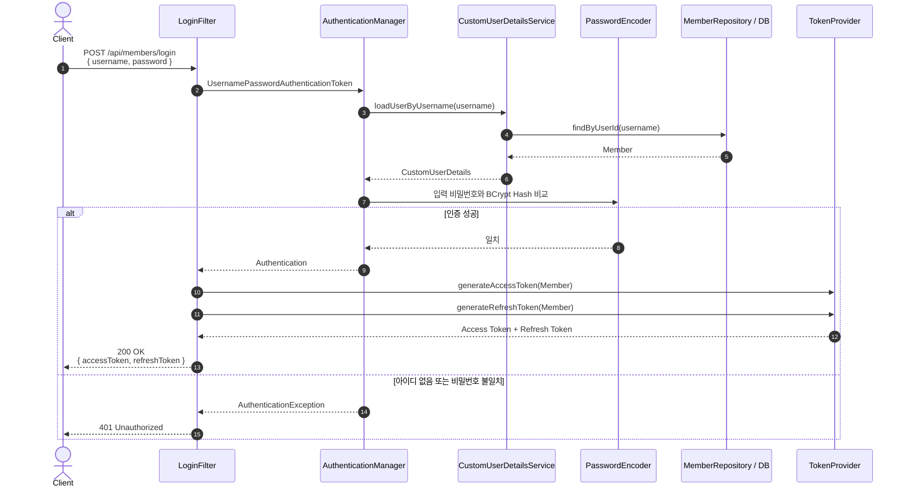
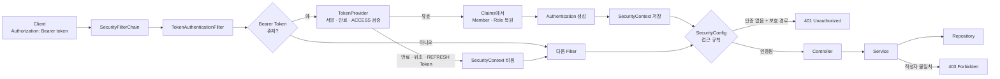
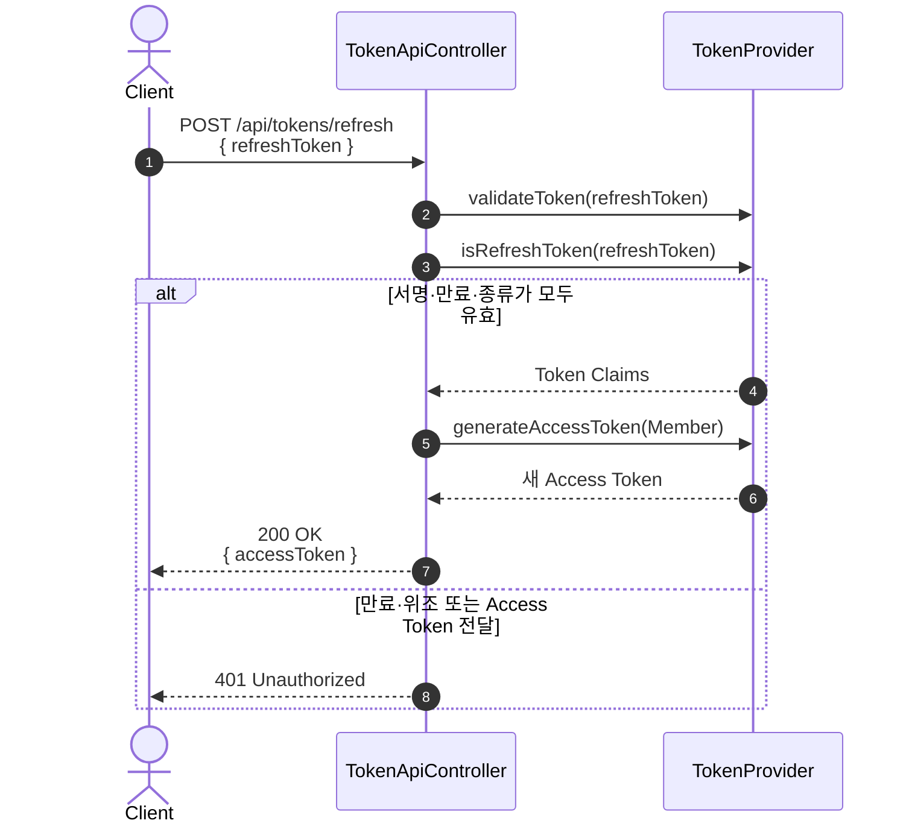
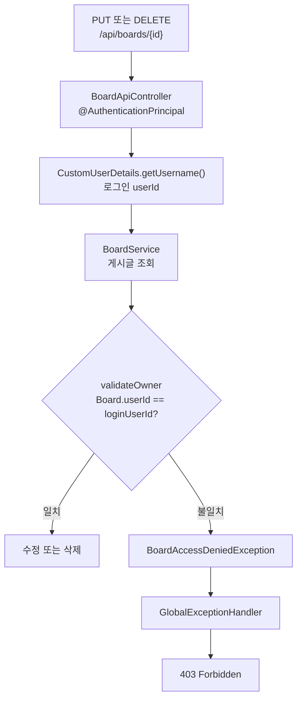
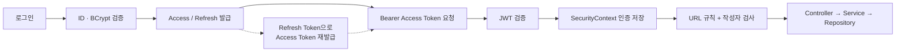

# Basic Board Security Flow

`basic-board`는 기존 세션 방식 대신 **Spring Security + JWT**로 사용자를 인증한다.

- **인증(Authentication)**: 요청한 사용자가 누구인지 확인한다.
- **인가(Authorization)**: 인증된 사용자가 해당 기능을 실행할 수 있는지 판단한다.
- 서버 세션은 생성하지 않으며(`STATELESS`), 매 요청의 Access Token으로 인증 정보를 다시 구성한다.

---

## 1. 인증·인가 핵심 구성요소

| 구성요소 | 역할 |
|---|---|
| `SecurityConfig` | Stateless 정책, 공개 경로, 인증 실패(`401`)와 인가 실패(`403`) 응답을 설정한다. |
| `LoginFilter` | `POST /api/members/login`을 처리하고 인증 성공 시 Access/Refresh Token을 발급한다. |
| `AuthenticationManager` | 로그인 정보를 Spring Security 인증 과정으로 전달한다. |
| `CustomUserDetailsService` | `MemberRepository`에서 `userId`로 회원을 조회한다. |
| `PasswordEncoder` | DB의 BCrypt 비밀번호와 로그인 비밀번호를 비교한다. |
| `TokenProvider` | HS512 JWT를 생성하고 서명·만료·토큰 종류를 검증한다. |
| `TokenAuthenticationFilter` | Bearer Access Token으로 `Authentication`을 만들어 `SecurityContext`에 저장한다. |
| `CustomUserDetails` | 인증된 `Member`와 `ROLE_USER` 또는 `ROLE_ADMIN` 권한을 표현한다. |
| `BoardService.validateOwner` | 게시글 수정·삭제 요청자가 작성자인지 확인한다. |
| `auth.js` | Bearer 헤더 추가, Access Token 재발급, 원래 요청 재시도를 공통 처리한다. |

`AuthenticationEntryPoint`와 `AccessDeniedHandler`는 별도 클래스가 아니라 `SecurityConfig` 내부에서 JSON 응답으로 설정되어 있다.

---

## 2. 로그인 및 JWT 발급 흐름

로그인은 컨트롤러가 아니라 `UsernamePasswordAuthenticationFilter`를 확장한 `LoginFilter`가 처리한다. 발급된 두 토큰은 현재 응답 JSON으로 반환되며, `signIn.js`가 모두 `localStorage`에 저장한다.

| 토큰 | 유효기간 | 실제 용도 |
|---|---:|---|
| Access Token | 2시간 | 보호된 API의 `Authorization` 헤더 |
| Refresh Token | 7일 | `POST /api/tokens/refresh`에서 새 Access Token 발급 |

두 토큰에는 `userId`, 이름, 역할과 함께 `ACCESS` 또는 `REFRESH` 종류가 기록된다. Refresh Token이 Bearer 인증에 사용되거나 Access Token이 재발급에 사용되지 않도록 종류를 구분한다.

---

## 3. JWT를 포함한 API 요청 흐름

`TokenAuthenticationFilter`는 `LoginFilter`보다 먼저 실행된다. 유효한 Access Token이면 JWT Claims의 회원 식별값과 역할로 `CustomUserDetails`를 만들며, 이 과정에서 DB를 다시 조회하지 않는다.

토큰이 없거나 유효하지 않으면 인증 정보 없이 필터 체인을 계속 진행한다. 보호 경로에서는 `SecurityConfig`의 `AuthenticationEntryPoint`가 요청을 중단하고 `401` JSON을 반환한다.

---

## 4. Access Token 재발급

재발급 엔드포인트는 요청 본문으로 받은 Refresh Token만 허용하고 새 Access Token 하나를 반환한다. 프런트엔드의 `authAjax`는 보호 API의 `401` 응답을 받으면 한 번 재발급한 뒤 원래 요청을 다시 보내며, 재발급도 실패하면 토큰을 제거하고 로그인 화면으로 이동한다.

---

## 5. 인가 처리 흐름

### URL 기반 인가

`SecurityConfig`는 공개 경로만 `permitAll()`로 선언하고, 나머지는 `authenticated()`로 제한한다. 현재 `hasRole(...)` 규칙과 `@PreAuthorize`는 사용하지 않으므로 `USER`와 `ADMIN`의 URL 접근 범위는 동일하다.

| 접근 정책 | 실제 경로 |
|---|---|
| 공개 | `/`, `/write`, `/detail`, `/update/**`, `/stats`, `/members/**` |
| 공개 | `POST /api/members/join`, `POST /api/members/login`, `POST /api/tokens/refresh` |
| 공개 | `/api/boards/file/download/**`, `/css/**`, `/js/**`, `/images/**`, `/favicon.ico` |
| 인증 필요 | 위 경로를 제외한 모든 요청 (`anyRequest().authenticated()`) |

따라서 게시글 목록·상세·검색을 포함한 `/api/boards/**` API와 `/api/members/info`, 댓글 작성 API는 모두 Access Token이 필요하다. 화면 URL은 공개되어 있지만 화면에서 호출하는 API는 보호된다.

### 게시글 작성자 인가

게시글 작성·댓글 작성 시에도 Request DTO의 사용자 값을 신뢰하지 않고 `@AuthenticationPrincipal`의 `userId`를 사용한다. 수정·삭제의 최종 작성자 판단은 `BoardService.validateOwner`에서 수행하므로 화면에서 버튼을 숨겨도 서버에서 다시 검증된다.

| 기능 | 인증 | 추가 인가 |
|---|:---:|---|
| 게시글 목록·검색·상세 API | 필요 | 없음 |
| 게시글 작성 | 필요 | JWT의 `userId`를 작성자로 저장 |
| 댓글 작성 | 필요 | JWT의 `userId`를 작성자로 저장 |
| 게시글 수정·삭제 | 필요 | `BoardService.validateOwner`에서 작성자 일치 확인 |
| 역할별 전용 API | - | 현재 없음 |

---

## 6. 인증·인가 실패 응답

| 상황 | 처리 위치 | 응답 |
|---|---|---|
| 로그인 아이디 또는 비밀번호 불일치 | `LoginFilter.unsuccessfulAuthentication` | `401 Unauthorized` |
| Access Token 누락·만료·위조·종류 불일치 | `TokenAuthenticationFilter` → `SecurityConfig.authenticationEntryPoint` | `401 Unauthorized` |
| Refresh Token 만료·위조·종류 불일치 | `TokenApiController` | `401 Unauthorized` |
| 인증됐지만 Spring Security 접근 권한 부족 | `SecurityConfig.accessDeniedHandler` | `403 Forbidden` |
| 다른 사용자의 게시글 수정·삭제 | `BoardService.validateOwner` → `GlobalExceptionHandler` | `403 Forbidden` |

---

## 7. 전체 흐름 요약

**인증**은 `LoginFilter`와 `TokenAuthenticationFilter`가 담당하고, **URL 인가**는 `SecurityConfig`, **게시글 작성자 인가**는 `BoardService`가 담당한다.
