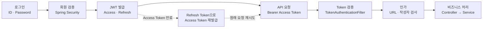
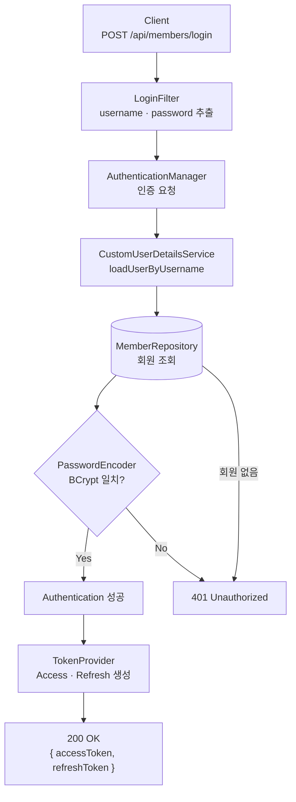
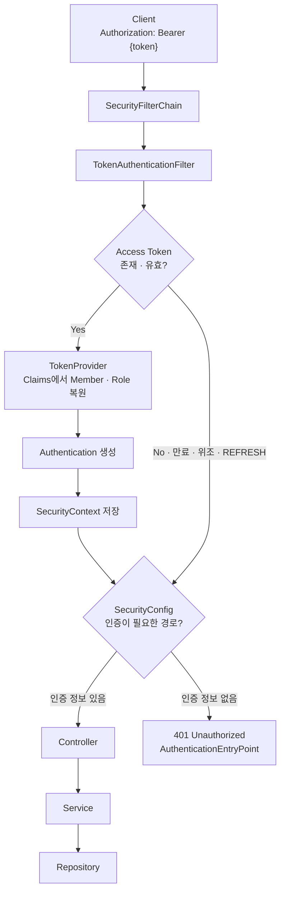
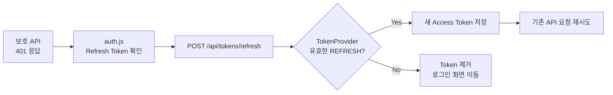
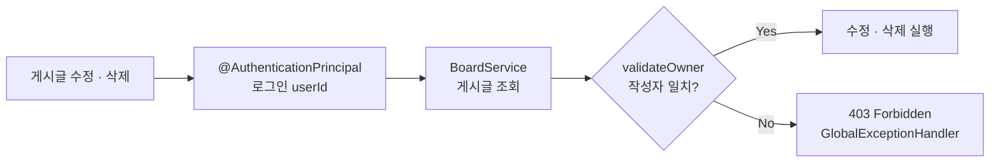

# Basic Board Security Flow

`basic-board`는 서버 세션을 생성하지 않고(`STATELESS`), **Spring Security + JWT**로 사용자를 인증한다.

| 구분 | 이 프로젝트에서의 의미 |
|---|---|
| **인증(Authentication)** | 로그인 정보 또는 Access Token으로 사용자가 누구인지 확인 |
| **인가(Authorization)** | 인증된 사용자가 API를 호출하거나 게시글을 변경할 수 있는지 판단 |

---

## 1. 전체 흐름 한눈에 보기



로그인 성공 시 Access Token과 Refresh Token을 발급한다. 이후 요청은 Access Token으로 인증하며, 만료되면 `auth.js`가 Access Token을 재발급하고 실패했던 요청을 한 번 다시 보낸다.

---

## 2. 인증·인가 핵심 구성요소

| 구성요소 | 역할 |
|---|---|
| `SecurityConfig` | Stateless 정책, 공개 경로, `401`·`403` 응답 설정 |
| `LoginFilter` | 로그인 요청 처리 및 JWT 발급 |
| `CustomUserDetailsService` | `userId`로 회원 조회 |
| `PasswordEncoder` | BCrypt 비밀번호 비교 |
| `TokenProvider` | Access/Refresh Token 생성 및 검증 |
| `TokenAuthenticationFilter` | Bearer Token 인증 후 `SecurityContext` 저장 |
| `BoardService.validateOwner` | 게시글 수정·삭제 작성자 검사 |
| `auth.js` | Bearer 헤더, 토큰 재발급, 요청 재시도 공통 처리 |

`AuthenticationEntryPoint`와 `AccessDeniedHandler`는 별도 클래스가 아니라 `SecurityConfig` 내부에 설정되어 있다.

---

## 3. 로그인 및 JWT 발급



`POST /api/members/login`은 컨트롤러가 아니라 `UsernamePasswordAuthenticationFilter`를 확장한 `LoginFilter`가 처리한다. 인증 성공 시 `TokenProvider`가 두 종류의 JWT를 생성하고 응답 JSON으로 반환한다.

| 토큰 | 유효기간 | 저장 위치 | 용도 |
|---|---:|---|---|
| Access Token | 2시간 | `localStorage` | 보호 API의 Bearer 인증 |
| Refresh Token | 7일 | `localStorage` | Access Token 재발급 |

두 토큰에는 회원 식별값과 역할 외에 `ACCESS` 또는 `REFRESH` 종류가 포함된다. 따라서 Refresh Token은 API 인증에, Access Token은 재발급에 사용할 수 없다.

---

## 4. Bearer Token 인증 요청



유효한 Access Token이면 JWT Claims로 `CustomUserDetails`와 `Authentication`을 구성하므로 요청마다 DB에서 회원을 다시 조회하지 않는다. 토큰이 없거나 유효하지 않은 보호 요청은 컨트롤러에 도달하지 않고 `401`로 끝난다.

---

## 5. Access Token 재발급



`TokenApiController`는 Refresh Token의 서명·만료·종류를 검증하고 새 Access Token 하나를 반환한다. `authAjax`는 재발급을 한 번만 시도하며, 재발급도 실패하면 저장된 토큰을 제거한다.

---

## 6. 인가 처리

### URL 기반 인가

`SecurityConfig`는 공개 경로만 `permitAll()`로 열고 나머지는 `authenticated()`로 제한한다.

| 정책 | 실제 경로 |
|---|---|
| 공개 화면 | `/`, `/write`, `/detail`, `/update/**`, `/stats`, `/members/**` |
| 공개 API | `/api/members/join`, `/api/members/login`, `/api/tokens/refresh` |
| 공개 리소스 | `/api/boards/file/download/**`, `/css/**`, `/js/**`, `/images/**`, `/favicon.ico` |
| 인증 필요 | 위 경로를 제외한 모든 요청 |

현재 `hasRole(...)`과 `@PreAuthorize`는 사용하지 않는다. `ROLE_USER`와 `ROLE_ADMIN`은 JWT와 `Authentication`에 포함되지만, 역할별 전용 API는 아직 없다.

### 게시글 작성자 인가



게시글과 댓글의 작성자는 Request DTO가 아니라 검증된 `@AuthenticationPrincipal`에서 가져온다. 수정·삭제는 화면의 버튼 노출 여부와 관계없이 `BoardService.validateOwner`에서 다시 작성자를 확인한다.

| 기능 | 인증 | 추가 인가 |
|---|:---:|---|
| 게시글 목록·검색·상세 API | 필요 | 없음 |
| 게시글 작성 | 필요 | JWT의 `userId`를 작성자로 저장 |
| 댓글 작성 | 필요 | JWT의 `userId`를 작성자로 저장 |
| 게시글 수정·삭제 | 필요 | 작성자 본인만 허용 |

---

## 7. 실패 응답

| 상황 | 처리 위치 | 응답 |
|---|---|---|
| 아이디 또는 비밀번호 불일치 | `LoginFilter` | `401 Unauthorized` |
| Access Token 누락·만료·위조·종류 불일치 | `SecurityConfig.authenticationEntryPoint` | `401 Unauthorized` |
| Refresh Token 만료·위조·종류 불일치 | `TokenApiController` → `GlobalExceptionHandler` | `401 Unauthorized` |
| Spring Security 인가 실패 | `SecurityConfig.accessDeniedHandler` | `403 Forbidden` |
| 다른 사용자의 게시글 수정·삭제 | `BoardService.validateOwner` → `GlobalExceptionHandler` | `403 Forbidden` |

---

## 8. 책임 요약

```text
로그인 인증       LoginFilter → AuthenticationManager → CustomUserDetailsService
JWT 요청 인증    TokenAuthenticationFilter → TokenProvider → SecurityContext
URL 인가         SecurityConfig
작성자 인가      BoardService.validateOwner
토큰 재발급      auth.js → TokenApiController → TokenProvider
```
